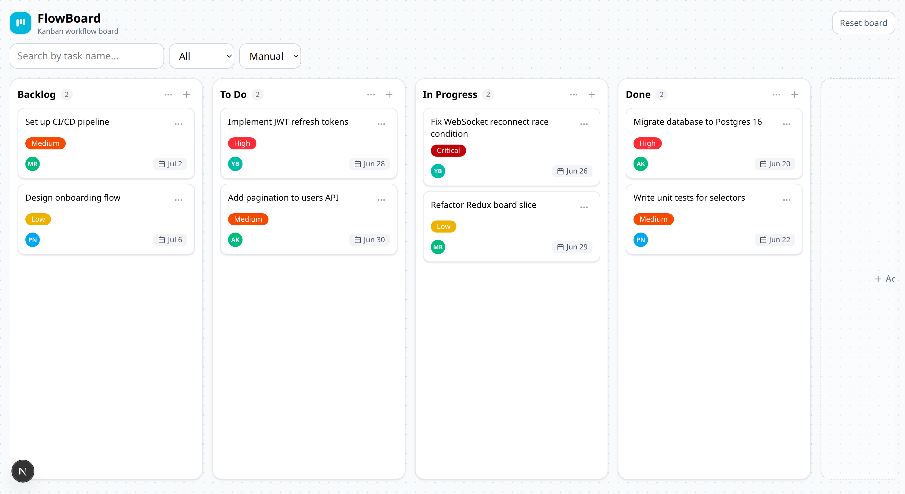

# FlowBoard — Kanban Workflow Board

A drag-and-drop kanban board for moving work across customizable columns — the kind of internal-tool UI you'd drop into an admin panel or project dashboard. It's fully keyboard-accessible, unit-tested, and persists across reloads with no backend required.

**Live demo:** [kanban-dashboard-pearl.vercel.app](https://kanban-dashboard-pearl.vercel.app/)

**Stack:** Next.js · React · TypeScript · Redux Toolkit · Tailwind CSS · dnd-kit



## Why

Most kanban demos stop at "drag a card." FlowBoard is built like a real internal tool: it handles the edge cases that actually come up — deleting a column without losing its tasks, renaming a label everywhere it's used, keyboard-only drag, and a clean reset — and it's covered by tests so the board logic can't silently regress.

## Features

- **Drag and drop** — reorder tasks within a column or move them across columns (pointer **and** keyboard, via dnd-kit).
- **Custom columns** — ships with **Backlog → To Do → In Progress → Done**, and you can add, rename, and delete your own. Deleting a column is **non-destructive**: its tasks are moved to an _Unassigned_ bucket (which only appears when it holds something) instead of being thrown away.
- **Tasks** — create/edit/delete with a title, description, status, labels, an **assignee**, and a **due date**.
- **PM-style cards** — each card shows its priority label plus a footer with an **assignee avatar** (initials in a color deterministically derived from the name) and a **due-date chip** (e.g. `Jun 28`).
- **Labels** — create labels with a color from a preset palette, edit (rename + recolor), and delete. Renaming rewrites every task that uses the label; deleting untags it everywhere. Names are normalized to sentence case.
- **Search, filter, and sort** — filter by title or label, and order each column manually (drag order), newest, or oldest.
- **Reset** — restore the default board in one click (with a confirmation).
- **Persistence** — the full board is saved to `localStorage` and restored on load (SSR-safe, so no hydration mismatch).
- **Accessible modals** — focus is trapped while open, `Esc` closes, and focus returns to the element that opened it.

## Tech stack

| Concern     | Choice                                                |
| ----------- | ----------------------------------------------------- |
| Framework   | Next.js (App Router)                                  |
| Language    | TypeScript (strict)                                   |
| State       | Redux Toolkit                                         |
| Styling     | Tailwind CSS, `clsx` + `tailwind-merge` (`cn` helper) |
| Drag & drop | `@dnd-kit/core` + `@dnd-kit/sortable`                 |
| Tests       | Vitest                                                |

## Getting started

```bash
npm install
npm run dev
```

Open [http://localhost:3000](http://localhost:3000).

### Scripts

```bash
npm run dev     # start the dev server
npm run build   # production build
npm run test    # run the unit tests
npm run lint    # lint
```

## Architecture notes

- **Single source of truth.** All board state (columns, tasks, labels, filters) lives in one Redux slice. Components read via memoized selectors; the visible board is derived (filtering, sorting, and hiding the empty Unassigned column happen in the selector, not the components).
- **Pure, tested reducers.** Every mutation is a pure reducer, which makes the tricky behavior — cross-column moves, non-destructive column delete, label rename/cascade — straightforward to unit-test. See [`src/redux/slices/boardSlice.test.ts`](./src/redux/slices/boardSlice.test.ts).
- **Reusable UI primitives.** A single polymorphic `InputField` (`input`/`textarea`/`select`) and a shared `Modal` (backdrop, Esc, focus trap, focus restore) keep the forms and dialogs consistent.
- **No backend by design.** This is a self-contained client app; persistence is `localStorage`. Swapping the persistence layer for an API would mean changing one module, not the UI.
